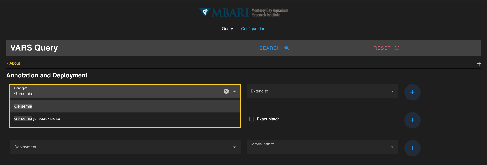
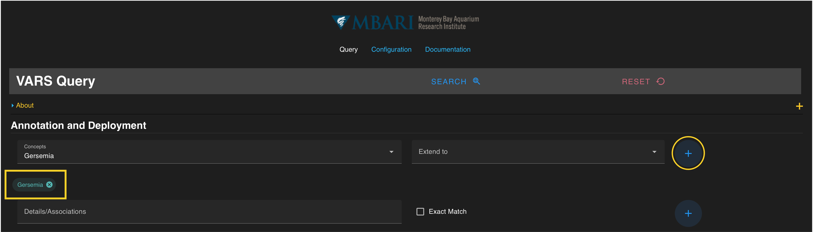
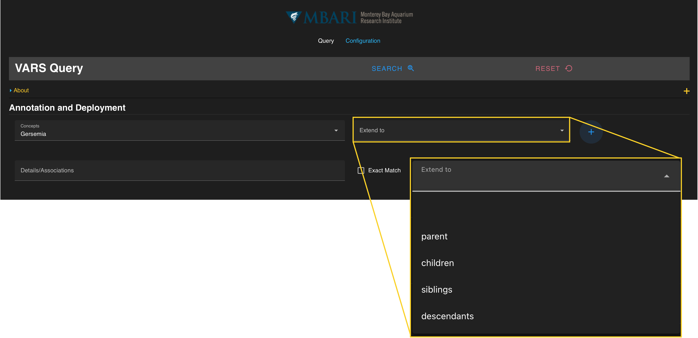

## *Selecting a Concept* ##

Concepts are selected from a database of all formal and common taxonomic, geologic, and technical names. Begin typing a name in the *Concepts* search box under the **Annotation and Deployment** section of the query. The selection options update as you type. A full list of concepts is located in [Appendix A](appendix_a.md). Alternatively, you can scroll through a drop-down list of available concepts in alphabetical order. Click on a name to select it. 

 

!!! warning "Note"
    If your search is returning a large amount of results, some data viewing functions will be disabled to prevent browser performance issues.  You will still be able to download the entire results.

 

In the example below, the concept *Gersemia* has been selected.

Once a concept is selected, add the term to the current query by pressing the **blue** :material-plus-circle: on the right. The concept should be visible in a **colored search chip** below the search box. Hovering over the **colored chip** shows all the concepts that will be added to the query. Concepts can be removed from a search by clicking the :octicons-x-circle-16: located on each chip. Multiple concepts can be added to the query by repeating this process. 

## *Extending a Concept Name* ##

Beyond selection of the primary concept name, the constraints can be extended to any level that exists in the VARS knowledgebase by selecting from the drop-down menu to the right of the “Concepts” search box (parent, children, siblings, and descendants). Definitions of each option are below.

-   **Parent** extends the search up one level in the hierarchy of the knowledgebase for the concept name selected (e.g. from genus level up to family level).
-   **Siblings** extends the database search to all in the same taxonomic level (e.g. allgenera found in the same family).
-   **Children** extends the query to one level below in hierarchy of the selectd concept (e.g. species level from the level of the genus).
-   **Descendants** extends the query to all the levels below the selected concept name (e.g. family all the way to species levels).

If the concept is a geologic or technical object, the same logic follows. For example, selection of the concept manipulator extended to “children” broadens the search to all types of manipulators (e.g. Kraft raptor, dongo, schilling arm, etc).

 

If all constraints have been specified, press the  **blue SEARCH** :material-search-web: on the floating banner to run your query. 

