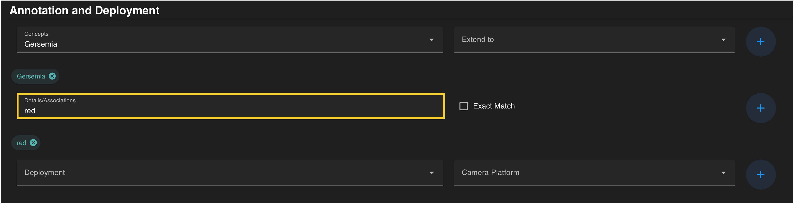
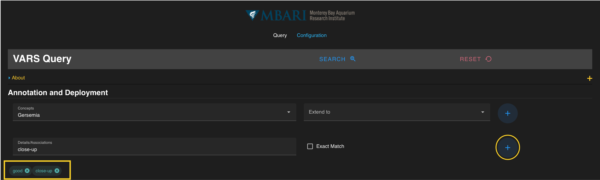

## *Adding Details and Associations* ##
There are multiple ways to constrain search results of a query by descriptive terms that have been added to an annotation. 
 
**General Search** allows users a quick way to open type a term that would constrain the query. This method pulls any annotations tagged with that term in it, including manually entered comments. For example, a search for the term “red” includes the color red, but also could include other terms that contain “red” such as altered or fractured. 

**Exact Match** constrains the search by specific associations from the knowledgebase. Once the *Exact Match* box is selected, an alphabetical list becomes available with *Link Name* values from the database. A full list of associations can be found in [Appendix B.](appendix_b.md)

!!! info "Link Name and Link Value Definitions"
    
    *   The **Link Name** is the the type or description of an attribute added to an association or concept (e.g. population-density). 
    *   The **Link Value** is the value of the attribute if the Link Name is not a self-contained descriptor (e.g. dense for the Link Name population-density).

 

Once a detail or link value is entered, add the term to the current query by pressing the **blue** :material-plus-circle: on the right. The term should be visible in a **colored search chip** below the search box. Details can be removed from a search by clicking the :octicons-x-circle-16: located on each chip.

If all constraints have been specified, press the  blue :material-search-web: on the floating banner to run your query. 

