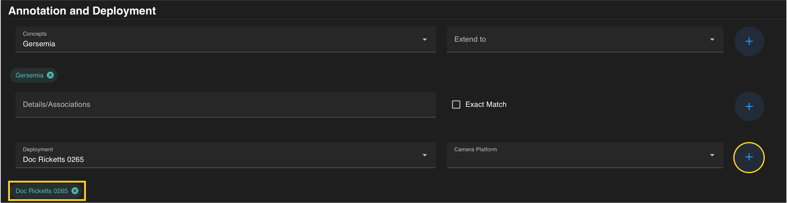

## *Deployments* ##

  Deployments refer to specific ROV dives or instrument deployments where data and imagery were collected. Deployments that have been registered in the VARS database can be used to constrain a query.

 
### *Deployment Identification Numbers* ###

-   **ROV Deployments** can be searched by the ROV Name and dive number (these also need to be  4-digit numbers, e.g. Doc Ricketts 0013).

??? info "Registered ROVs in VARS"

     *   Doc Ricketts
     *   Mini ROV
     *   Tiburon
     *   Ventana
 

 

-   **AUV Deployments** are categorized by name of the platform and date (YYYYMMDD). The exception in this style of identification is the Galene Optim, which is in order of deployment.  

??? info "Registered AUVs in VARS"

     *   Ahi (1, 2)
     *   Daphne (1, 2)
     *   Galene Optim
     *   i2MAP
     *   Makai (1, 2, aft, forward)
     *   Pontus (1, 2)
     *   Triton 47

 

-   **Other Deployments** include equipment specific to particular labs  that use labels based on their internal naming convention.

??? info "Other Registered Platforms in VARS"

     *   ArcticRays
     *   Coral Observatory
     *   Macro Coral Cam
     *   Station M Tripod

 

Once a deployment is entered, add the term to the current query by pressing the **blue** :material-plus-circle: on the right. The selection should be visible in a **colored search chip** below the search box. Details can be removed from a search by clicking the :octicons-x-circle-16: located on each chip.

## *Camera Platforms* ###

A Camera Platform specifies the platform a camera was deployed on while recording the selected observations. 

 

??? info "Currently Registered Camera Platforms in VARS"

     *   *AUV:* Ahi(1,2), Daphne, Galene Optim, i2MAP, Makai(1,2), Piscivore, Pontus(1,2)
     *   *Benthic Rover II*
     *   *ROV:* Doc Ricketts, Mini ROV, Tiburon, Ventana
     *   *Tripod Camera:* Coral Observatory, Macro Coral Cam, Station M Tripod
     *.  *TopoCam*

 

Once a camera platform is entered, add the term to the current query by pressing the **blue** :material-plus-circle: on the right. The term should be visible in a **colored search chip** below the search box. Details can be removed from a search by clicking the :octicons-x-circle-16: located on each chip.

If all constraints have been specified, press the  **blue SEARCH** :material-search-web: on the floating banner to run your query. 

