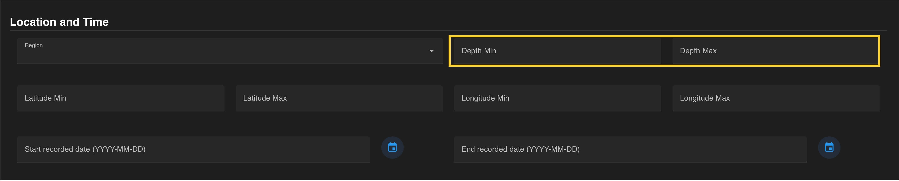
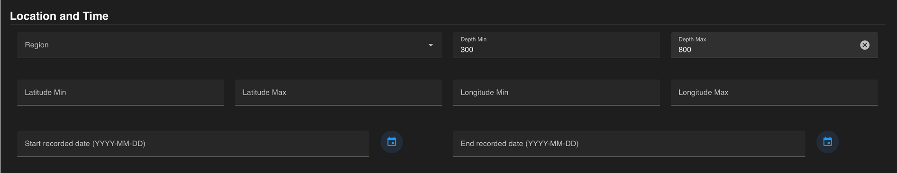

A query can be constrained by **depth** ranges. A minimum and/or maximum depth can be entered in meters. For a single depth, enter the same value in the minimum and maximum fields. 

 
Minimum and Maximum depth entries are automatically added to the query once added in their entry fields. Depths can be removed by clicking the **“x”** that becomes visible when hovering over this field.

If all constraints have been specified, press the  blue :material-search-web: on the floating banner to run your query. 

