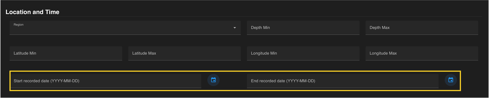
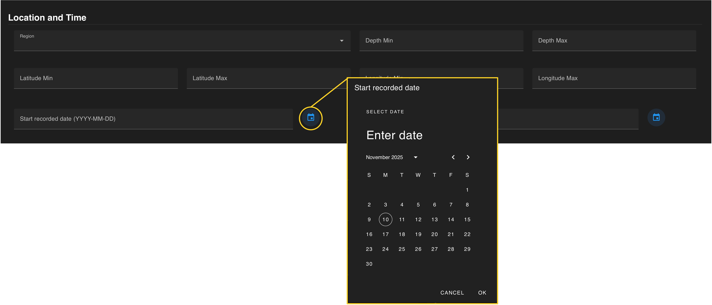

A query can be constrained by the date a deployment began. The *recorded date* is the date the data/imagery was collected. A start and/or end recorded dates can be entered manually in a YYY-MM-DD format. All dates and times are in UTC. 

 

 

Dates can  also be seleted using the calendar function on the right side of the entry field. Dates can be entered as a range or a singular date. To constrain to one day, choose the same date for the start and the end of the date range.

  

Recorded dates are automatically added to the query once added in their respective entry fields. Each field can be removed by clicking the white **“x”** that appears when hovering over this field.  

 
 

If all constraints have been specified, press the **blue search button** on the floating banner to run your query. 

