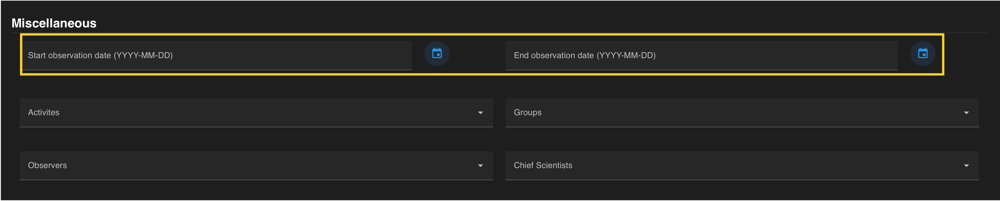

A query can be constrained by the date an observation date. An *observation date* is the date the annotation itself was made. This is different from the recorded date. Dates and times are in UTC. 

 

 

Observation dates can  also be seleted using the calendar function on the right side of the entry field. Dates can be entered as a range or a singular date. To constrain to one day, choose the same date for the start and the end of the date range. 

  

If all constraints have been specified, press the **blue search button** on the floating banner to run your query. 

