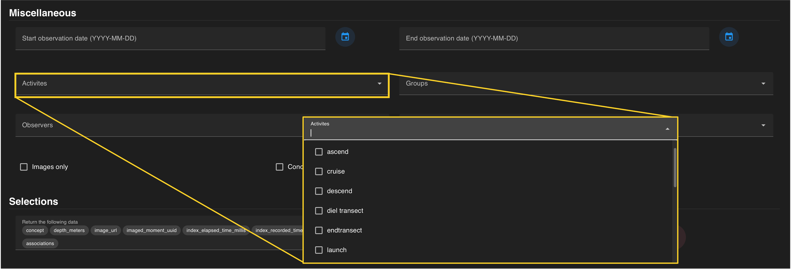
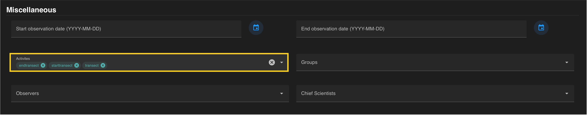

An *activity* includes the direction or movement of the camera or the intended activity associated with a particular annotation. You can constrain your search by one or more activities selected from the drop-down menu.

??? info "Available Activities in VARS"

     *   ascend
     *   cruise
     *   descent
     *   diel transect
     *   endtransect
     *   launch
     *   localize
     *   nil
     *   off transect
     *   possible duplicate
     *   starttransect
     *   stationary
     *   test
     *   topo
     *   tracking begin
     *   tracking end
     *   transect
     *   transect-like
     *   unspecified

 

Activities are automatically added to the query once selected within the drop down menu. Each activity should be visible in a **colored search chip** within the *activities* search field. Individual activities can be removed from a search by clicking the :octicons-x-circle-16: located on each chip.  The entire field can be reset by clicking the white :oticons-x-circle: on the right that becomes visible when hovering over the field.

If all constraints have been specified, press the  blue :material-search-web: on the floating banner to run your query. 

