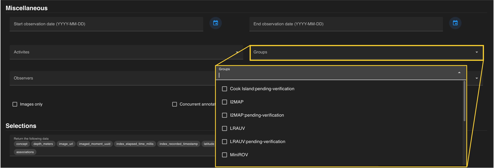
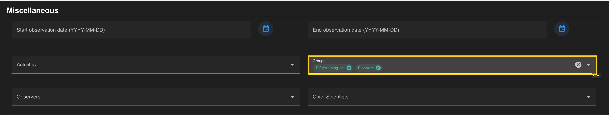

A *group* indicates additional information to categorize annotations within the VARS database. The groups are linked to a camera platform. Additional information can include project-based efforts or machine learning aspects used to distinguish the annotations from standard core data. You can constrain your search by one or more groups selected from the drop-down menu. Groups can also be typed into the search field then selected to avoid scrolling through the menu.

??? info "Available Groups in VARS"

     *   Cook Island:pending-verification
     *   i2MAP
     *   i2MAP:pending-verification
     *   LRAUV
     *   LRAUV:pending-verification
     *   MiniROV
     *   Piscivore
     *   Piscivore:pending-verification
     *   ROV
     *   ROV:fn-localization-effort-lkuhnz
     *   ROV:pending-verification
     *   ROV:training-set
     *   TopoCam
      

 

Groups are automatically added to the query once selected (a check mark) within the drop down menu. Each group should be visible in a **colored search chip** within the *groups* search field. Individual groups can be removed from a search by clicking the **“x”** located on each chip.  The entire field can be reset by clicking the white **"x"** on the right that becomes visible when hovering over the field.
 
  

If all constraints have been specified, press the **blue search button** on the floating banner to run your query. 

