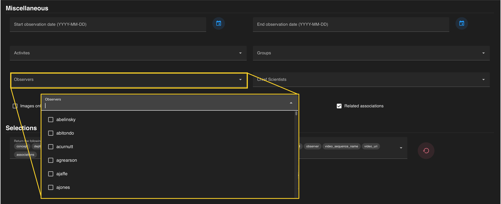
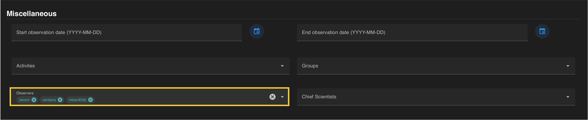

An *observer* can be added to constrain your search by a particular annotator (e.g., lemon), vessel crew (e.g., ventana), or model generator (e.g., mbari452K) entered in the VARS database. You can constrain your search by one or more observers. These names can be typed into the search field then selected from the drop-down menu.

!!! info "VARS Observers"

    VARS observers are all users that have a VARS login. A new user login can be created through the [VARS Annotation Interface.](https://docs.mbari.org/vars-annotation/) 
      
 

Observer entries are automatically added to the query once selected (a check mark) within the drop down menu. Each observer should be visible in a **colored search chip** within the *observers* search field. Individual groups can be removed from a search by clicking the :octicons-x-circle-16: located on each chip.  The entire field can be reset by clicking the white :octicons-x-circle-16: on the right that becomes visible when hovering over the field.
 

If all constraints have been specified, press the  **blue SEARCH** :material-search-web: on the floating banner to run your query. 

