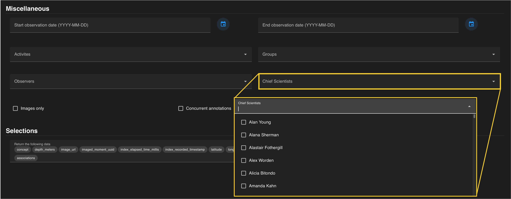
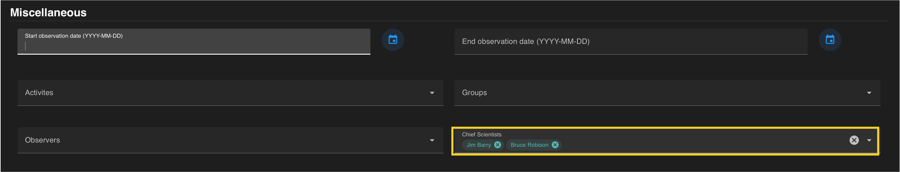
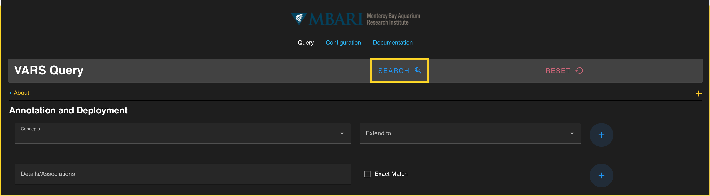

A *chief scientist* can be selected to constrain your search for dives led by a particular scientist (e.g. Jim Barry).  Chief scientists can be selected from a drop-down menu of MBARI scientists and their collaborators.

Chief scientist entries are automatically added to the query once selected (a check mark) within the drop down menu. Each chief scientist should be visible in a **colored search chip** within the *chief scientists* search field. Individual chief scientists can be removed from a search by clicking the :octicons-x-circle-16: located on each chip.  The entire field can be reset by clicking the white:octicons-x-circle-16: on the right that becomes visible when hovering over the field.
 

If all constraints have been specified, press the  blue :material-search-web: on the floating banner to run your query. 

