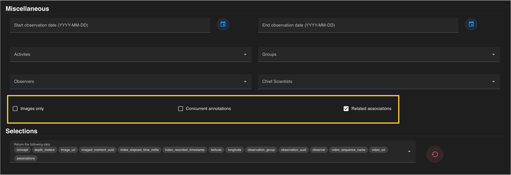

At the bottom of the query page, there are features to restrict or include annotations depending on the user’s preference. These can be turned on and off via a checkbox.

***Images only*** will return only annotations that have an associated image.

***Concurrent annotations*** will return all annotations from the same time (video frame).

***Related associations*** returns all the associations for each  annotation. 

 

If all constraints have been specified, press the  **blue SEARCH** :material-search-web: on the floating banner to run your query. 

