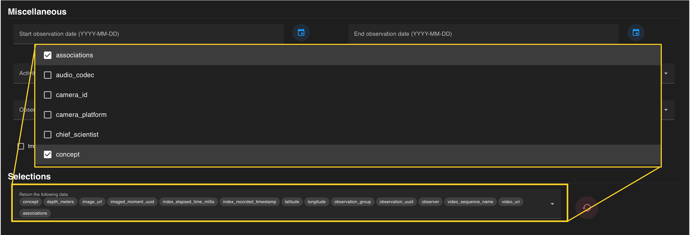
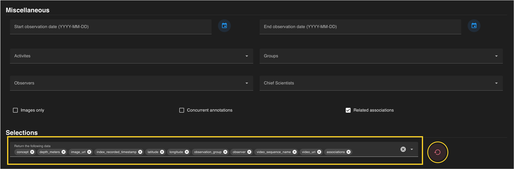

The bottom of the query page lists the ancillary data returned with each association by default. Additional data can be added to your results by selecting checkboxes from a drop-down menu. 

!!! warning "Note"
    The  red :fontawesome-solid-undo: will reset to the default ancillary data parameters. This does not reset the entire query.

 

Data parameters are automatically added to the query returns once selected (a check mark) from the drop-down menu. Each parameter can be removed by clicking the **“x”** located on each chip. The entire field can be reset to the default ancillary data by clicking the  red :fontawesome-solid-undo: on the right of the search field.

 

If all constraints have been specified, press the  blue :material-search-web: on the floating banner to run your query. 

