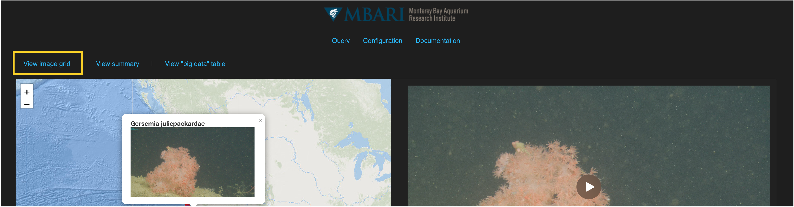
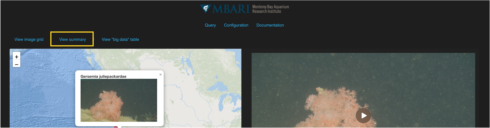
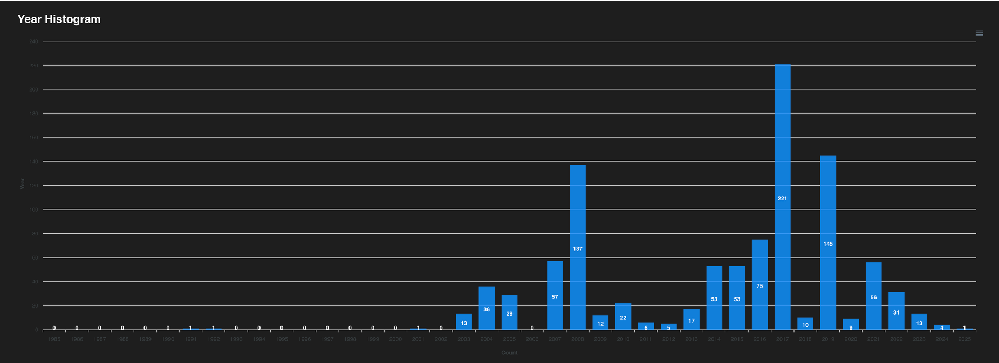
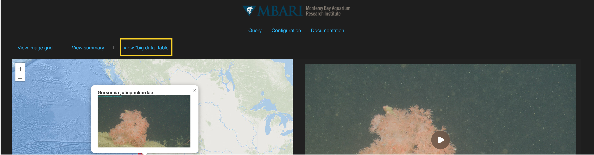
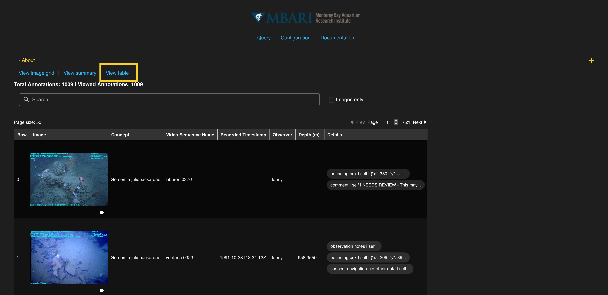

## *Image Grid View* 

Query results can also be viewed in an image grid layout by clicking the top left link labeled “View image grid.” This format is useful for a quick visual review of datasets.

The image grid can be adjusted to show 1 to 6 images per row. Each image will enlarge when you click on it. There are also options to enlarge the jpg or png under each image grid. Click on the image again to go back to the image grid. The video can be accessed by clicking the video camera icon (:material-video:). This opens in a new window so be sure to check your pop-up settings in your browser if it does not appear. Click **Back to the results table** to view your query results table.

## *Summary View* 

The summary view of the query results shows a depth histogram, a year histogram and temperature-talinity (T-S) diagram.  

Click **Back to the results table** to view your query results table.

!!! warning "NOTE"

     Temperature and salinity variables will need to be selected in your returned ancillary data to appear in this summary view. They are not included in the default settings.

      

## *"Big Data" Table View* 

The "big data" table view of the query results shows a stripped down version of the query results. Parameters include and image (when applicable), the concept name, recorded timestamp, observer, depth, and details. 

!!! warning "NOTE"

     The table sorting functionality is removed in this view. Users can still click for images and videos to pop up in a new window

 

