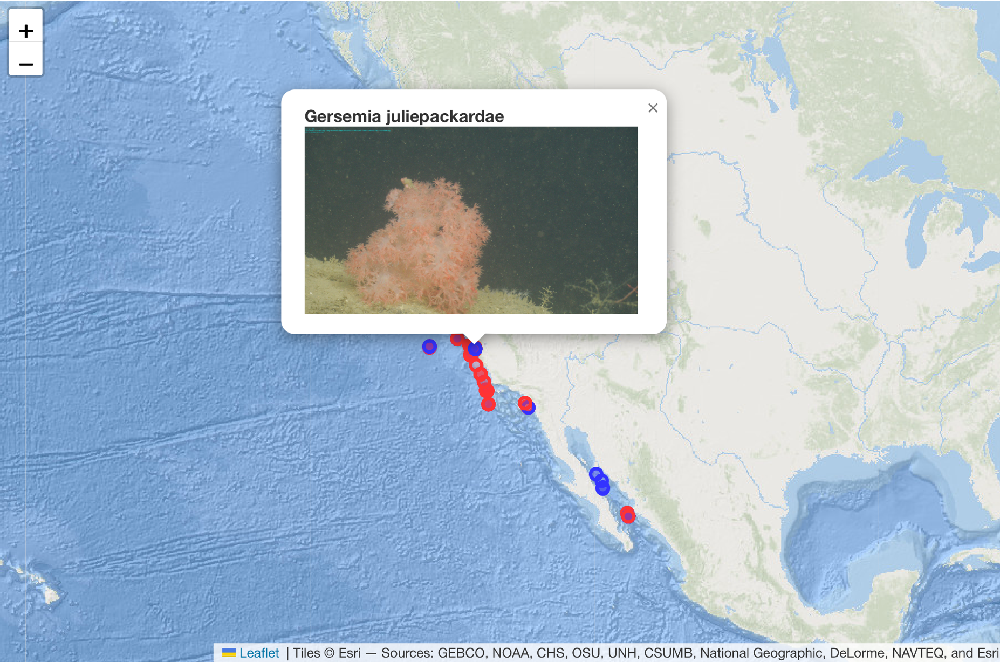

The query map shows the location of all returned annotations. The map can be zoomed in or out once selected. Annotations without an image appear in red. Annotations with an image appear in blue. When an annotation is selected in the returns table, the image will appear on the map. Conversely, selecting an observation on the map will highlight the annotation in the table.

The map provides standard zoom and pan functionality, allowing users to explore geographic regions in greater detail, similar to other mapping interfaces. After interacting with the map, users must click outside the map area to restore functionality to the results table and other interface elements.

 

