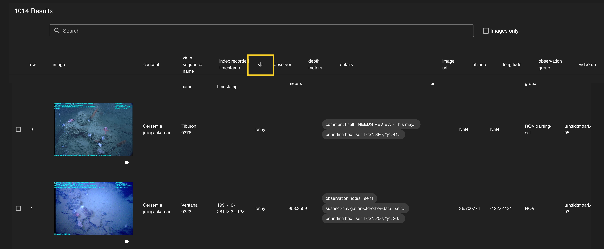
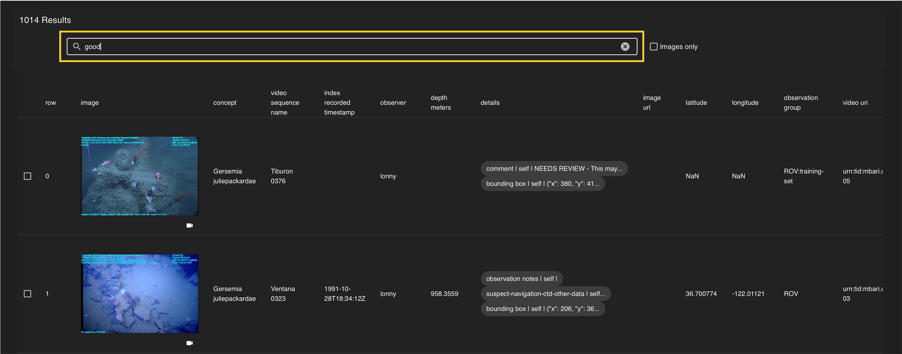
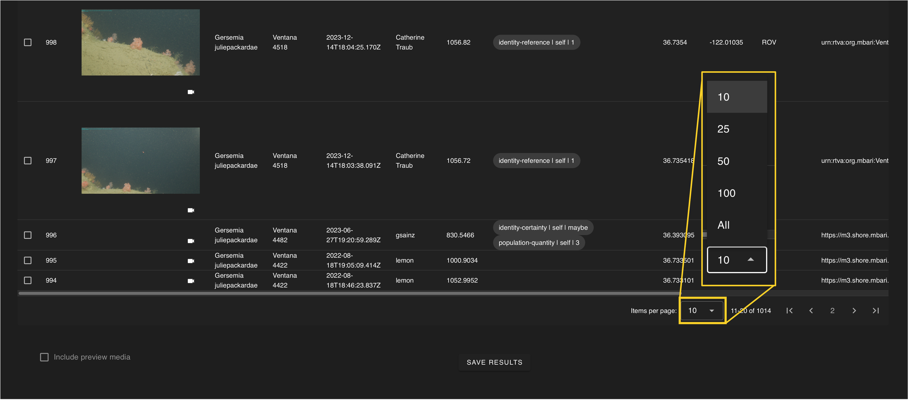

Query results are displayed in a table. Clicking on an annotation row will display that annotation on the map and queue up the video player to that observation. 

## *Data Columns* ##

Each column represents a data field (e.g. concept, depth, details). Annotations can be sorted by each of the columns using arrows that appear to the right of each column title.

 
## *Annotation Rows* ## 
Each row is a unique annotation that meets the query parameters. 
  
## *Images* 

If an annotation includes an image, it will be displayed in the corresponding row. Clicking on the image will open it full size in a separate browser window. Under each image there is a video camera icon (:material-video:) that will open the video in a new window.

## *Additional Filtering Post Query* 

Additional filtering can be made using the search bar at the top of the query table (e.g. typing good in the searcg box will filter only annotations that have good in the details column). 

## *Pagination Toolbar*  

The table defaults to showing 10 annotations per page. The number of annotations displayed can be changed to 25, 50, 100, or All using the drop-down menu at the bottom of the page. NOTE: Large queries may have decreased performance if all annotations are selected.

