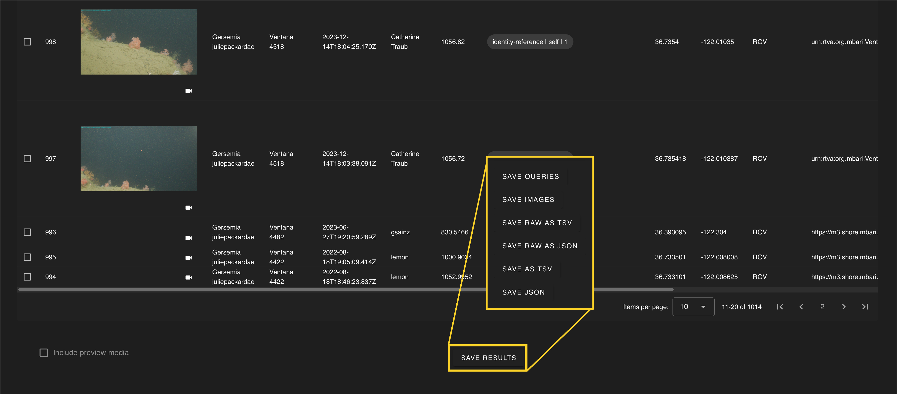

There are multiple options to download both the specified query parameters and the query results.

!!! info "Options for Saving Data"

     *   **Save queries**: saves the constraints used to generate the annnotation results in a JSON file.
     *   **Save images**: saves the images from queried results.
     *   **Save raw as TSV**: saves the raw query results, as would be returned by a SQL query, in a tab-seperated-values file.
     *   **Save raw as JSON**: saves the raw query results, as would be returned by a SQL query, in a JSON file.
     *   **Save as TSV**: saves query results as tab seperated values. *This is great for importing into Excel.*
     *   **Save as JSON**: saves query results as JSON. *This is best for importing into other applications or python.*
      

