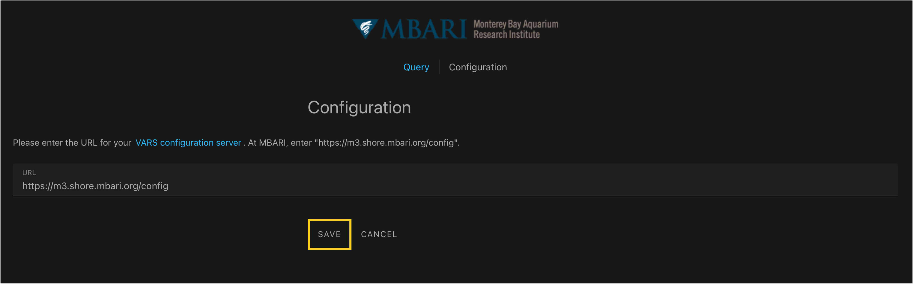
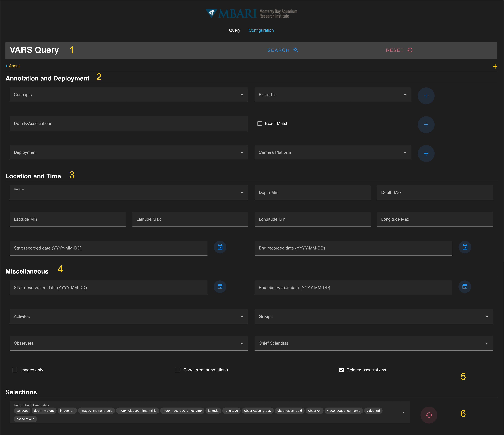

# Getting Started
 
## *Query Configuration*
The VARS Query is a web-based application found here: <https://m3.shore.mbari.org/query/>
  
Click on the “Configuration” tab in the top header. When selected, the text will turn white.
 

 
 
Enter the URL for your VARS configuration server (At MBARI: <https://m3.shore.mbari.org/config>). Press save. Once this is set up, it will remain saved for future visits to the query application.

## *Query Interface Orientation*

The VARS query interface uses a series of parameter fields to easily search specific onbservation.  An overall layout detailed below. For more detailed information on each search parameters, go to the [User Guide](https://docs.mbari.org/internal/vars-query-vue/doc_01_general_info/.) or the links below.

1 VARS Query Floating Toolbar
   - The **blue **SEARCH** button** executes the search once all desired parameters are added.
   - The **red **RESET** button** will remove all parameters entered for a query.

2 Annotation and Deployment Parameter Fields
   - [Concepts](doc_02_selecting_concept.md) 
   - [Associations](doc_03_add_associations.md)
   - [Deployments and Camera Platforms](doc_04_add_deployments_cameraplatform.md)
  

3 Location and Time Parameter Fields
   - Location
   - Depth
   - Recorded Date

4 Miscellaneous Parameter Fields
   - Observation Date
   - Activities
   - Groups
   - Observers
   - Chief Scientists

5 Additional Constraint Selections

6 Additional Ancillary Data Returns
  
  

