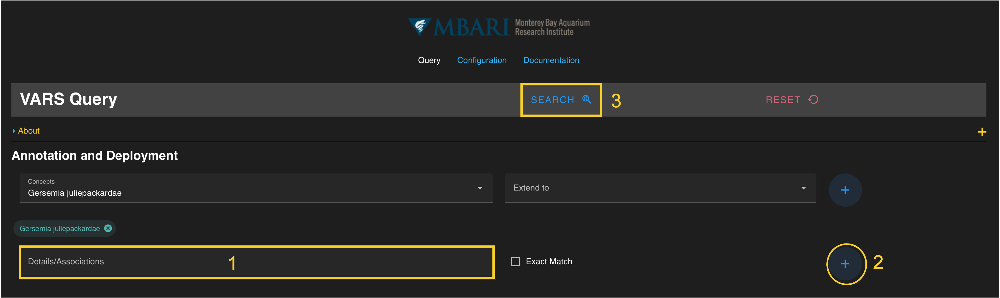

# **Search by Concept**

Before you begin searching with the query tool, make sure your system is properly configured. Please follow instructions on the [Getting Started](doc_getting_started.md) page to ensure your settings are correctly set up.

Once configuration is complete, this section will guide you through the basic steps of running a search based on concepts.

## Concept Overview

Concepts are selected from a database of all formal and common taxonomic, geologic, and technical names. Begin typing a name in the “Concepts” search box under the **Annotation and Deployment** section of the query. The selection options update as you type. A full list of concepts is located in [Appendix A](appendix_a.md). Alternatively, you can scroll through a drop-down list of available concepts in alphabetical order. Click on a name to select it. (Step 1 in image below)

!!! note
    If you do not select a concept parameter, you will be query the entire VARS database.  This will cause the query to fail.

## *Selecting a Concept* ##

Once a concept is selected, add the term to the current query by pressing the **blue **+** button** on the right. (Step 2 in image below)  The concept should be visible in a **colored search chip** below the search box. Hovering over the colored chip shows all the concepts that will be added to the query. Concepts can be removed from a search by clicking the **“x”** located on each chip. Multiple concepts can be added to the query by repeating this process. 

Beyond selection of the primary concept name, the constraints can be extended to any level that exists in the VARS knowledgebase by selecting from the drop-down menu to the right of the “Concepts” search box (parent, children, siblings, and descendants). For more information on the "extend to" definitions, go to the [Selecting a Concept](doc_selecting_concept.md) page.

Once all constraints have been specified, press the **blue search button** on the floating banner to run your query. (Step 3 in image below)

In the example below, the concept *Gersemia juliepackardae* has been entered.

For more information on additional search parameters, go to the User Guide.