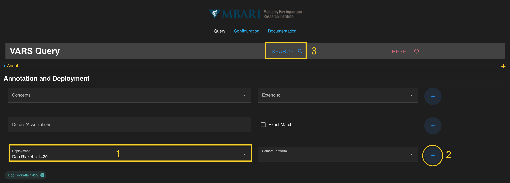

# Search by Deployment

# Overview

Before you begin searching with the query tool, make sure your system is properly configured. Please follow instructions on the [Getting Started](doc_getting_started.md) page to ensure your settings are correctly set up.

Once configuration is complete, this section will guide you through the basic steps of running a search based on concepts.

## Deployment Overview ##

Users can search the VARS database by deployment, or dive, to view all observations annotated during a specific deployment. Begin typing the deployment ID in the “Deployment” search box under the **Annotation and Deployment** section of the query. The selection options update as you type. Click on a name to select it. (Step 1 in image below)

!!! note "Deployment Identification Numbers"
    - ROV deployments can be searched by the ROV name and dive number. These need to be in 4-digit numbers (e.g. Doc Ricketts 1429). 
    - AUV deployments can be searched by name of the platform and date (e.g. Daphne 2 20240318).
    - Other platforms use labels based on the specific projects (e.g. Coral Observatory 202106).

Once a deployment is selected, add the term to the current query by pressing the **blue **+** button** on the right. (Step 2 in image below)  The deployment should be visible in a **colored search chip** below the search box. Deployments can be removed from a search by clicking the **“x”** located on each chip. Multiple concepts can be added to the query by repeating this process.

Once all constraints have been specified, press the **blue search button** on the floating banner to run your query. (Step 3 in image below)

For more information on additional search parameters, go to the User Guide.